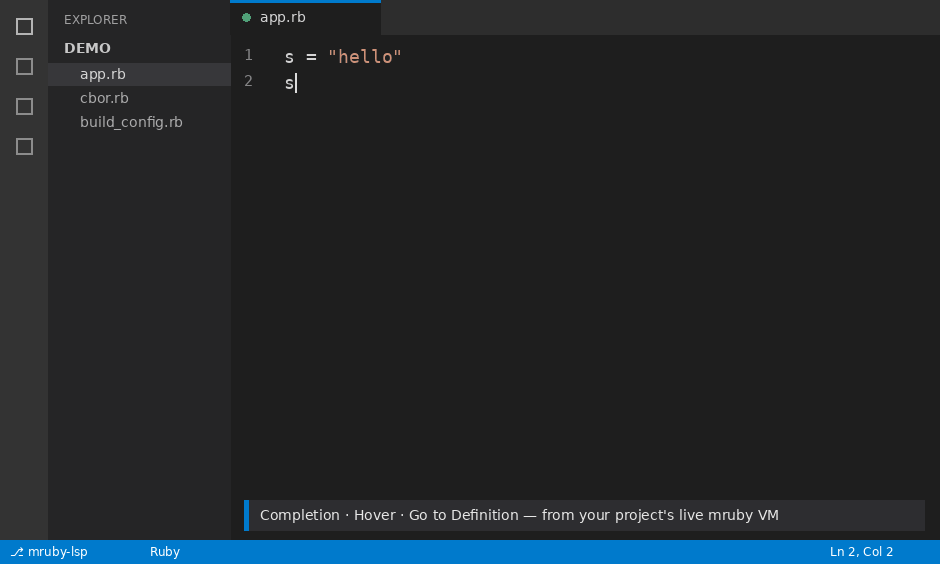

# mruby-lsp

**A language server for [mruby](https://mruby.org) that answers from your project's
own compiled runtime — not from a guess about what mruby "usually" has.**

If a method exists in *your* build, it completes, jumps, and shows docs. If it
doesn't, it doesn't. No surprises from a standard library you didn't compile in.

> **Status: pre-1.0, not published anywhere yet.** Not on RubyGems, not in
> mgem-list. For now you install it from a clone of this repo (see below).

## Demo



<!-- This GIF is generated, not a real recording — regenerate it with:
     python3 docs/media/gen_demo.py   (needs Pillow). Swap in a real screen
     capture here when you have one. -->

## Contents

- [Why mruby needs its own language server](#why-mruby-needs-its-own-language-server)
- [What you get](#what-you-get)
- [Requirements](#requirements)
- [Install](#install)
- [Set up your project](#set-up-your-project)
- [Using it in your editor](#using-it-in-your-editor)
- [Debugging](#debugging)
- [Troubleshooting](#troubleshooting)
- [Limitations](#limitations)
- [Updating](#updating) · [Uninstalling](#uninstalling) · [Development](#development) · [License](#license)

## Why mruby needs its own language server

mruby has no fixed standard library. It's a compiler *and* a VM, and **every
project compiles its own runtime** from its `build_config.rb` (its gembox plus
chosen mgems) — so two mruby projects can expose completely different APIs. No
static analyzer can know yours ahead of time; only your compiled binary knows it.

mruby-lsp builds your project's mruby once, loads it, and **asks the live VM**
what classes and methods actually exist. The running build is the source of
truth. (It's a standalone server, not a ruby-lsp add-on — ruby-lsp is built
around CRuby conventions that don't apply here.)

## What you get

Completion, hover, and go-to-definition — including **into the C source** that
defines a built-in — plus signature help with real overloads, find-references,
rename, document & workspace symbols, semantic highlighting, type hierarchy,
inlay hints, folding, and selection ranges.

**Scaffolds you can be lazy with.** Type a few letters and take a snippet: `class`
(named, with an `initialize`), `def`, and the class-body DSL —
`attr_reader`/`attr_writer`/`attr_accessor`, `alias_method`,
`include`/`prepend`/`extend` — drop in with the `:`/`,` already there and the
cursor on the first hole. After a receiver you also get block forms (`coll.each`
→ `each do |…|`) whose parameter names are **read from the method's own source** —
its `yield`/`block.call` in Ruby, `mrb_yield`/`mrb_funcall` in C (tracking the
captured block value). Where a yielded value has no name in the source (`each`
yields `self[idx]`), you get an editable `${1:item}` placeholder, never a guessed
name. Emitted only to editors that advertise snippet support.

**Unsaved edits count immediately.** Classes and methods you're typing right now —
`include`/`prepend`/`extend`, `attr_*`, `alias`, visibility changes, even
`undef_method` — take effect as you type, layered over the compiled VM with
mruby's real semantics. After a rebuild the VM catches up and the overlay shrinks
to whatever is still unsaved.

**Pin a type when you want to.** mruby-lsp infers types from your build —
assignments, `Foo.new`, and even C constructors that hand back a fresh instance
of their receiver (`IO.for_fd` → `IO`, read from the clangd AST) — but you can
state a method's types with an RBS-style comment on the line directly above it,
and a hand-written annotation always wins over inference. Use `#:` in Ruby
source and `//:` in C source; both take RBS method-type syntax (parsed by the
`rbs` gem):

```ruby
#: (Socket) -> String
def read_line(io)
  io.gets        # io completes as Socket; the result types as String
end
```

```c
//: (Integer) -> String
static mrb_value
int_to_hex(mrb_state *mrb, mrb_value self)
{ /* ... */ }
```

In Ruby the annotation types both the parameters (a param used as a receiver
completes and jumps as its annotated class) and the return value; in C it sets
the return type that drives typing of chained calls. Anything not concrete
(`void`, `untyped`, a union) is ignored, so inference still runs.

**Declared instance-variable types.** mruby-lsp builds
[`mruby-native-ext-type`](https://github.com/Asmod4n/mruby-native-ext-type) into
its reflection VM, so a class's `native_ext_type :@conn, Socket` declaration is
read straight from the live VM — `@conn.` completes as `Socket` even before any
assignment is in view. (To actually *run* such a class, your own build needs the
gem too; mruby-lsp only adds it to the build it reflects on.) It's a baseline,
not a cage: a visible reassignment of the ivar wins (as dynamic as Ruby), and a
union declaration (more than one type) stays unresolved rather than guessed.
An `attr_reader`/`attr_accessor` for a typed ivar inherits its type, so
`obj.conn` (and `obj.conn.`) resolve as `Socket` too — and a `native_ext_type`
you're typing right now takes effect immediately, shadowing the compiled build.

## Requirements

- **Ruby ≥ 3.0** on your machine (the server runs on host Ruby).
- A **C toolchain**: `gcc`, `make`, `git`.
- **`binutils`** (`addr2line`, `nm`) — used to jump into C source for built-ins
  (Linux/BSD; on macOS/Windows the C-source features are off — see Limitations).
- **`clangd`** (optional, recommended) — powers the C-source half of several
  features: C return-type inference, C doc comments on hover, the **real
  parameter names** in C-method signatures (parsed from `mrb_get_args`), and the
  **block-parameter names** in block scaffolds (from `mrb_yield`/`mrb_funcall`).
  It's BYO; without it those degrade gracefully — C signatures fall back to
  `arg1, arg2…`, C block scaffolds drop out, C return types fall back to what your
  test suite reveals, C docs are absent — and everything else keeps working.
  (These C-source features are Linux/BSD only for now; see Limitations.) You do
  **not** need to symlink or rename anything: the server discovers it
  automatically — a plain `clangd`, a versioned `clangd-NN` (it picks the highest,
  e.g. `clangd-22`), a clangd next to your `clang`, or one under an LLVM/Homebrew
  dir. Set `MRUBY_LSP_CLANGD` to a path to override. Install:
  - Arch / CachyOS: `sudo pacman -S clang`
  - Debian / Ubuntu: `sudo apt install clangd` (or `clangd-NN`)
  - Fedora: `sudo dnf install clang-tools-extra`
  - FreeBSD: in the base system (`clang`), or `pkg install llvm`
  - openSUSE: `sudo zypper install clang-tools` (ships a versioned `clangd-NN`;
    discovery finds it, no symlink needed)
  - macOS: `brew install llvm` (discovery checks the Homebrew LLVM dir even if
    it isn't on `PATH`)
- Your project's mruby checkout, **built from a recent mruby HEAD — not a tagged
  release** (see the note below).

> **Why HEAD and not a release?** The server reads each method's parameters and
> source location from the running VM. Every mruby release up to and including
> 4.0.0 has a long-standing bug that crashes the VM when you do that on a C
> method — so the server would crash on startup. Building mruby from current HEAD
> avoids it. It's the one thing people trip over, so do it first.

## Install

Everything starts from a clone (nothing is published yet):

```bash
git clone --recursive https://github.com/Asmod4n/mruby-lsp
cd mruby-lsp
```

**VS Code / VSCodium** (also VSCode-OSS and code-server) — one command (needs one
of `codium`/`code`/`code-oss`/`code-server` on PATH):

```bash
rake vscode:install
```

It packages the extension with the server and all its gems bundled, removes any
stale copy, and installs it. Reload the window when it's done.

**Any other editor** — install the gem and its tools:

```bash
rake install
```

You get three commands: **`mruby-lsp`** (starts the server), **`mruby-lsp-setup`**
(one-time per-project setup), and **`mruby-lsp-update`** (refresh mruby and
pulled-in gems). On Linux each of these is a small compiled sandbox launcher
that confines itself and then execs the real Ruby entry point — see
[Development](#development); on other platforms they're pass-through wrappers.

## Set up your project

Declare your gems (including any custom mgem) in your project's normal
`build_config.rb` and **build it once**, so the build lock exists — setup reads
which config you use from that lock:

```bash
cd /path/to/your/project/mruby && rake     # produces build_config.rb.lock
mruby-lsp-setup /path/to/your/project
```

Setup finds your mruby root and build config, builds a parallel copy of libmruby
it can reflect on, compiles a small reflection extension against it, and records
the paths. Re-running only rebuilds what changed. Two promises:

- **Your build config is never edited and your build tree is never touched.**
  Setup replays your config into a *separate* parallel build and adds only what
  reflection needs (debug info, `-fPIC`, a couple of reflection gems).
- **Setup state lives outside your project** (under your home dir, not the
  workspace), so a cloned repo can't pretend it was already trusted or set up on
  your machine.

In **VS Code / VSCodium** this is easier: open an unconfigured mruby project,
trust the workspace when prompted, and the extension offers to build it for you.

## Using it in your editor

**VS Code / VSCodium.** Open an mruby project and **trust the workspace** — the
extension only builds, installs, or starts the server in a trusted workspace.
Commands (palette, prefix `mruby-lsp:`): Build/Setup Server, Rebuild Now, Restart
Server, Stop Server, Update mruby, Update Pulled-in Gems. Settings:
`mrubyLsp.rebuildOnSave`, `mrubyLsp.requestTimeout`, `mrubyLsp.rubyPath`,
`mrubyLsp.trace.server` (off by default; `verbose` logs the full LSP
conversation), and the debugger settings `mrubyLsp.mrdbPath`,
`mrubyLsp.debugStopOnEntry`, `mrubyLsp.debugTrace` (see [Debugging](#debugging)).

**Any other LSP client.** The server speaks standard LSP over stdio. Run
`mruby-lsp-setup` for the project first, then launch it with the workspace root:

```
mruby-lsp /path/to/your/project
```

The path is optional — the workspace also comes from the `rootUri` your client
sends on `initialize` (an explicit argument wins). Example for mrbmacs (an editor
written in mruby, verified against this server):

```ruby
@ext.config['lsp'] = { 'ruby' => { 'command' => 'mruby-lsp' } }
```

## Debugging

mruby-lsp drives **`mrdb`** (mruby's own debugger, from the `mruby-bin-debugger`
gem) over the Debug Adapter Protocol, so you can set breakpoints, step, and
inspect variables from your editor. In VS Code / VSCodium, open a `.rb` (or a
compiled `.mrb`) and press **F5** — pick the file when prompted, or add a launch
config of type `mruby`.

A few things specific to mruby:

- **The file you launch IS the entry point.** mruby has no fixed `main`: a
  project might start from top-level code, a `main`/`__main__` call, or a method
  in another gem. So mruby-lsp assumes nothing and runs the file you give it,
  with no arguments — put whatever starts your program in that file. A `.rb` runs
  as source; a `.mrb` runs as bytecode (point `sourceDir` at its `.rb` sources so
  listings and breakpoints resolve).
- **It pauses on the first line by default.** mrdb launches already stopped at
  the first executable line, so you land there and can step/inspect from the
  start. Turn it off with `"stopOnEntry": false` (or the
  `mrubyLsp.debugStopOnEntry` setting) to run straight to your first breakpoint.
  Breakpoints on later lines stop as usual; the Variables view is mrdb's
  `info locals`, and hover/watch evaluate through mrdb.
- **mrdb is YOUR build's mrdb, never one we ship.** It's tied to your exact mruby
  version and gem set, so a foreign `mrdb` can't run your bytecode. It's
  auto-detected from the mruby build mruby-lsp already reflects (then `PATH`);
  point `mrubyLsp.mrdbPath` at it if needed (e.g. `<mruby>/build/host/bin/mrdb`).
- Set `mrubyLsp.debugTrace` (or `"trace": true` in the launch config) to echo the
  full mrdb command/response dialog to the Debug Console when a breakpoint or
  prompt doesn't behave.

Debugging a **natively compiled** mruby executable (an ELF that embeds the VM) is
**not** supported — mrdb runs the `.rb`/`.mrb` it loads, it doesn't attach to a
process. For that, use `gdb`/`lldb` on the binary directly.

## Troubleshooting

**No completions, or hover/go-to-definition come up empty.** Work down this list:

1. Is mruby built from a recent **HEAD**? A release ≤ 4.0.0 crashes reflection on
   startup (see [Requirements](#requirements)).
2. Did you run **`mruby-lsp-setup /path/to/project`**?
3. In VS Code / VSCodium, did you **trust the workspace**? Nothing builds or
   starts until you do.
4. Did you build `build_config.rb` **once** so a `*.rb.lock` exists? Setup keys on
   it.

**"Build once first" / setup can't find a config.** Discovery looks for a
`*.rb.lock`. Run `rake` against your build config once to produce it.

**Go-to-definition into C doesn't land.** You need `binutils` (`addr2line`, `nm`)
installed; setup's parallel build adds the debug info the jump relies on.

**C signatures show `arg1, arg2`, or no return type / no C docs / no C block
scaffold.** These C-source features need `clangd` (see
[Requirements](#requirements)) — without it they degrade and the rest is
unaffected. A versioned `clangd-NN` is fine (no symlink needed); the server finds
the highest one. If yours sits somewhere unusual, point `MRUBY_LSP_CLANGD` at it.
(On macOS/Windows these are off regardless — see Limitations.)

**VS Code: opening the project does nothing.** The extension activates on a folder
containing `include/mruby.h` and only acts once the workspace is trusted.

## Limitations

mruby-lsp implements the full set of LSP capabilities ruby-lsp advertises
(completion, hover, definition, references, rename, signature help, document &
workspace symbols, semantic tokens, type hierarchy, inlay hints, folding,
selection ranges, document highlight, diagnostics). Where it differs, it differs
**by design** — its truth is your live mruby VM, not CRuby + RBS:

- **mruby semantics, not CRuby.** Classes, methods, and signatures come from your
  compiled build, so they match what actually runs — and differ from CRuby/RBS
  where mruby differs (its own core method set, C-method signatures from the VM,
  `Struct`/`Data` as mruby defines them). There is no RBS/standard-library
  knowledge layered on top.
- **No build-tool world.** mruby's `.rake`, `mrbgem.rake`, and `build_config.rb`
  run in host CRuby at build time and never enter the VM, so they aren't indexed
  (ruby-lsp's Rake-DSL symbols, Bundler composition, and test-runner discovery
  have no mruby equivalent and are intentionally not emitted).
- **Native debugging is out of scope** (see [Debugging](#debugging)): mrdb debugs
  `.rb`/`.mrb`, not a compiled ELF — use `gdb`/`lldb` for that.
- **mruby must be built from HEAD** (see [Requirements](#requirements)) — releases
  ≤ 4.0.0 crash VM reflection on startup.
- **The Linux sandbox needs Landlock**; on other platforms the launcher is a
  pass-through (no confinement) — see [Development](#development).
- **C-source features are Linux/BSD only** right now: go-to-definition into C, C
  return types, C doc comments, C parameter names, and C block scaffolds all map a
  compiled method back to its `.c` source via an `addr2line`-shaped symbolizer.
  That covers ELF (Linux and the BSDs — `llvm-addr2line`/`llvm-nm`), but the macOS
  Mach-O path (`.dSYM`/`atos`) and Windows aren't wired yet, so those C features
  stay off there. Everything else (the whole Ruby/VM side) works on every
  platform.

## Updating

```bash
mruby-lsp-update mruby /path/to/your/project   # git-pull the mruby checkout, rebuild
mruby-lsp-update gems  /path/to/your/project   # refresh fetched gems, rebuild
```

Or use the two **Update** commands in the VS Code extension.

## Uninstalling

Uninstalling the editor extension does **not** remove what mruby-lsp *built*. The
build cache and a small setup-state store live under your home directory.
mruby-lsp derives these from the passwd database (NOT `$XDG_*`/`$HOME`), so the
sandbox launcher's allow-list and the build always agree on the same dirs — for
a normal login shell that's the paths below:

```bash
rm -rf "$HOME/.cache/mruby-lsp"        # per-project builds
rm -rf "$HOME/.local/share/mruby-lsp"  # setup state
```

If you installed via the gem, also remove the executables and the vendored
runtime gem (leave `prism` and `language_server-protocol` — other projects use
them too):

```bash
gem uninstall mruby-lsp value_bridge
```

## Development

```bash
# run the server (Ruby) from the checkout, via the CLI dispatcher's server role:
ruby -Ilib -r mruby_lsp/cli -e 'MrubyLsp::CLI.run(ARGV.shift, ARGV)' -- server /path/to/project
cc -O2 -o /tmp/mruby-lsp ext/mruby_lsp_launcher/launcher.c   # build the sandbox launcher
cd test/overlay && for t in *_test.rb; do ruby "$t"; done
cd editors/vscode && npm install && npm test       # headless extension tests
```

On installed gems, `mruby-lsp`, `mruby-lsp-setup`, and `mruby-lsp-update` are
each the SAME compiled sandbox launcher (one binary, installed under all three
names); it picks its role from its own basename via `/proc/self/exe` and execs
Ruby on the gem's CLI dispatcher (`lib/mruby_lsp/cli.rb`), handing it the role
(`server`, `setup`, `update`) — there is no per-command binstub. The environment
steers nothing — no env var widens the allow-list, redirects the target, or
toggles a step. The sandbox runs on every Linux launch; there is no env opt-out.
If the kernel lacks Landlock it does **not** silently run unconfined — it asks for
your explicit consent (a `window/showMessageRequest` dialog) and shuts down if you
decline. See `docs/design/SANDBOX-CROSSPLATFORM.md`.

Start with `AGENTS.md` (orientation), then `docs/` for the architecture notes;
read `docs/GOTCHAS.md` before changing native or build code — it's the project's
hard-won institutional memory.

## License

MIT — see [LICENSE](LICENSE).
