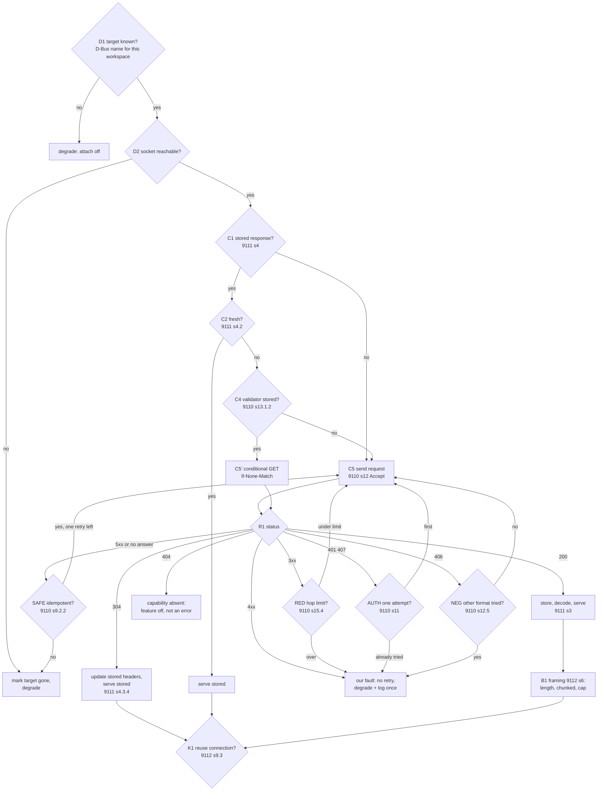

# Attach mode: driving the LSP off a live VM over HTTP

Status: DESIGN ONLY. Nothing below is built. It specs the client half of the
attach mode #14 names, and the resource surface the client talks to.

#14 lists two modes for reaching a real mruby build. Driver mode spawns a
confined host that `dlopen`s a symbol-only `.so`. Attach mode is the other one:
*the tool's own production process already started a server side, and we connect
to drive the LSP off its live VM.* This document is only about attach mode.

The transport is [webmachine-mruby](https://github.com/Asmod4n/webmachine-mruby):
an mruby HTTP server that already runs inside a target process, already speaks
HTTP/1.1 and HTTP/2 on a unix socket, and already executes the server-side
decision graph. So the server half is a set of resources, not a protocol, and
the piece that does not exist yet is the client.

---

## Why HTTP, and not a bespoke frame

Reflection is a read-only graph of named things: classes, their ancestors, their
methods, each method's parameters and source location. That is a resource tree,
and asking for it is a GET. Modelling it as REST is not decoration — it buys
four things that a bespoke CBOR frame would have to reinvent, and that
webmachine already implements on the server side:

- **Conditional requests.** Populate is one GET of the whole snapshot. A
  repopulate is the same GET with `If-None-Match`, and a VM that has not changed
  answers 304 with no body. Today's rebuild path throws the index away and walks
  a fresh VM; here the common case costs one round trip and no parse.
- **Content negotiation.** The wire format is `Accept`, not a build-time choice
  (see "Wire format" below).
- **Compression.** `Accept-Encoding: gzip` over a snapshot of a few hundred
  kilobytes of names, decided by the server's own rules.
- **Status codes as a vocabulary.** A verb this target does not serve is a 404,
  not a protocol error. Version skew degrades one feature instead of failing the
  connection.

The cost is that the client must be a real HTTP client. That is the work this
document specs.

## No RFC publishes a client-side decision diagram

Worth saying plainly, because it shaped the graph below. Webmachine's server
graph is not in an RFC either: it is
[for-GET/http-decision-diagram](https://github.com/for-GET/http-decision-diagram),
an activity diagram *derived* from what are now RFC 9110, 9111 and 9112, filling
in where the RFCs are prose. There is no drawn client equivalent. The nearest
thing is RFC 9111 section 4, "Constructing Responses from Caches", which is a
genuine decision procedure written as numbered steps.

So the client graph below is derived the same way the server's was, from the
client-side sections, with every node citing the section it comes from. That
citation is the point: a node nobody can trace to a section is a node nobody can
review.

---

## The client's decision graph

One pass answers one query. Every node either advances or degrades; no node
raises out of the client.



### The nodes, and where each comes from

| Node | Decision | Source |
|---|---|---|
| D1 | Is a target advertised for this workspace? | this document, "Discovery" |
| D2 | Does its socket accept a connection? | — |
| C1 | Is there a stored response for this key? | RFC 9111 §4 |
| C2 | Is it fresh (`Cache-Control`, `Age`, `Date`)? | RFC 9111 §4.2 |
| C4 | Do we hold a validator to ask with? | RFC 9110 §13.1.2 |
| C5 | Send, with `Accept` and `Accept-Encoding` | RFC 9110 §12 |
| R1 | Dispatch on status class | RFC 9110 §15 |
| UPD | 304: update the stored headers, serve the stored body | RFC 9111 §4.3.4 |
| STORE | 200: may we store it, and under what key | RFC 9111 §3, §4.1 (`Vary`) |
| RED | Follow a redirect, bounded; 303 rewrites to GET | RFC 9110 §15.4 |
| AUTH | Answer a challenge once, never in a loop | RFC 9110 §11 |
| NEG | Renegotiate the format once after a 406 | RFC 9110 §12.5 |
| SAFE | Retry only a safe, idempotent request, once | RFC 9110 §9.2.1, §9.2.2 |
| B1 | Read the body by its framing, under a size cap | RFC 9112 §6 |
| K1 | Keep the connection or close it | RFC 9112 §9.3 |

Every reflection query is a GET, so SAFE is always satisfiable. That is
deliberate: it is what makes a dropped connection a retry rather than a
question.

### Degrading is a node, not an exception

The house rule is degrade, don't crash. In this graph that is structural: OFF,
GONE, NOVERB and OURS are terminal nodes that return "no answer" to the caller.
`Index` already treats a missing reflection layer as "the VM layer is empty",
and Prism-only features keep working. A target that dies mid-session is D2 on
the next query.

---

## The bridge contract: what the client must answer

`Reflector.open` wraps one object and `populate` only ever calls these. A client
that answers the same set is a drop-in, and nothing else in the server changes:

```
constants(namespace)             -> [String]
instance_methods(klass)          -> [String]
private_instance_methods(klass)  -> [String]
singleton_methods(klass)         -> [String]
ancestors(klass)                 -> [String]
parameters(klass, meth)          -> flat [kind, name, kind, name, ...]
source_location(klass, meth)     -> [path_or_nil, line_or_nil]
cfunc_offset(klass, meth)        -> Integer | nil
anchor_addr                      -> Integer
return_type(klass, meth)         -> String | nil
close                            -> nil
```

The client is therefore not a new abstraction. It is a second implementation of
an interface that already has one, which also means the existing `Reflector`
tests describe it.

## The resource surface

Per-call round trips would be thousands of requests, so the snapshot is the
primary resource and the rest exist for re-query:

| Resource | Answers |
|---|---|
| `GET /vm` | mruby version, pid, executable path, anchor address, capability list |
| `GET /snapshot` | the whole graph in one body: every namespace, its ancestors and kind, every method with parameters, source location, cfunc offset, return type |
| `GET /classes/{name}` | one namespace, for a re-query after a change |
| `GET /classes/{name}/methods/{sym}` | one method |

Populate is `GET /vm` then `GET /snapshot`. Everything after that is
`If-None-Match` on `/snapshot`.

`/vm` carries the executable path because the C-location path needs it (below).

## C locations point at the real binary

This is the part attach mode gets *more* right than the `.so` path, and it needs
no new mechanism.

`cfunc_offset` is already relative: the offset of a C function from `&mrb_open`,
computed inside the VM that owns both. The target computes it in its own address
space and reports the same integer. The client then resolves it exactly as
`CLocator` does today, except against the target's own executable named by
`/vm`: `nm` gives `mrb_open`'s link-time address in that file, add the offset,
`addr2line` it. Address-space layout randomisation does not enter into it —
nothing crosses the boundary but a relative offset.

So the file/line/doc for a C method comes from the binary the user is actually
running. The same requirement as today applies and should be stated in the
README: the target must carry debug info, and a stripped release binary gets no
C locations.

Ruby `source_location` is the path the target's build recorded. That resolves
when the target runs on this machine. A target in a container or on another host
reports paths this editor cannot open; the client must not invent a mapping. A
path that does not exist becomes no location, which is the same degrade as a
stripped binary.

## Discovery: D-Bus

The session bus is per-user, so "who may talk to whom" is already answered by
the bus, and there is no directory to scan and no path to guess.

A target that opts in takes a well-known name and exposes one object:

```
name:      org.mruby.Lsp.Target.<sanitised tool name>
object:    /org/mruby/Lsp/Target
interface: org.mruby.Lsp.Target1
  properties: SocketPath s, Workspace s, Pid u, Executable s, Generation t
  signal:     Changed(t generation)
```

The client lists names under `org.mruby.Lsp.Target.`, keeps those whose
`Workspace` is this LSP workspace root, and connects to `SocketPath`. `Changed`
is the invalidation hint: it tells the client a conditional GET is now worth
making, and the client still validates rather than trusting the signal.

Two consequences worth naming. The client needs a D-Bus client on CRuby, which
is a dependency decision (see the open questions). The target needs one in
mruby, which does not exist yet and is work in the server-half gem.

## The listener is the reflection app's own

webmachine serves any number of applications in one process, and an application
names its own listener. So the reflection routes are a separate application with
a unix-socket listener of its own — never a route on the app's public listener.
A production build that does not add the gem has no listener and no bus name,
and nothing to turn off.

## Security

- **Read-only, closed verb set.** Four GET resources. No eval, no `send`, no
  writes. The client cannot make the target do anything but describe itself.
- **No foreign code in the server.** Attach mode is strictly safer than driver
  mode: we never `dlopen` the tool's code, we read an answer over a socket. The
  no-net/no-exec server of #6 stays intact.
- **Local only.** A unix socket, user-private, plus `SO_PEERCRED` to confirm the
  peer's uid. No TCP, ever.
- **Opt-in and inert by default.** The app must add the gem and mount the
  application. Production builds do not.
- **The answer is data.** Names, line numbers and integers, parsed into
  `Index::Entry` records. The client validates shape and rejects what does not
  fit rather than passing it on.

---

## Open questions

- [ ] **Wire format.** The client sends `Accept: application/cbor,
      application/json;q=0.9` and the server picks, so both can exist. The
      question is which the client must be able to read: `json` is CRuby stdlib
      and costs nothing; CBOR needs a gem in the host's vendored closure, which
      the `.vsix` fetches at package time. Recommendation: JSON as the floor,
      CBOR when the gem is present, negotiated by the graph's own node.
- [ ] **The ETag.** mruby exposes no class-table generation counter, so a weak
      ETag over the serialised snapshot means walking the VM to answer a
      conditional request. The walk is ~90ms; 304 then saves the transfer and
      the host-side parse but not the walk. Is a cheap fingerprint (class count,
      method count, a counter the gem bumps on `define_method`) worth the hook?
- [ ] **Which VM answers.** webmachine's compute workers each own their own VM.
      The reflection application must answer from the reactor VM the app
      registered, and must say so, or it reflects a worker's copy.
- [ ] **Snapshot cost inside the target.** The walk runs in the target's
      request path. It must not block the reactor for a user-visible time, and
      it allocates. Does it belong on a compute worker after all, with the
      worker VM problem above solved another way?
- [ ] **D-Bus on the host.** `ruby-dbus` as a dependency, or speak the session
      bus protocol directly over its socket. The bus protocol is small, and the
      gem is another vendored dependency; measure before choosing.
- [ ] **D-Bus in mruby.** No binding exists. Scope it in the server-half gem.
- [ ] **Snapshot or re-query.** The index is swapped atomically today. Attach
      keeps that: populate takes a snapshot, `Changed` plus a conditional GET
      produces the next one. Per-class re-query is specced above but may not be
      needed at all in the first cut.
- [ ] **Both sources at once.** A workspace may have a built `reflect_so` and a
      live target. Attach should win when a target is advertised, and the README
      must say which one answered.

## Tasks

- [ ] The client: the graph above, over a unix socket, with the eleven bridge
      ops on top and the existing `Reflector` tests pointed at it
- [ ] The stored-response layer: cache key with `Vary`, freshness, validators
- [ ] D-Bus discovery on the host, plus the target-gone path
- [ ] `CLocator` against a target executable rather than the reflect `.so`
- [ ] The server half (separate gem, per #14): the walker, the four resources,
      the unix-socket application, the bus name
- [ ] Conformance: replay the graph against a stub target that answers 304, 404,
      406, 5xx and a dropped connection, and assert the terminal node

## References

- #14 — the arc issue this is one half of; driver mode and the symbol-only `.so`
- #6 — the fd-capability and no-net/no-exec model the security section reuses
- `lib/mruby_lsp/reflector.rb` — the bridge contract, and `NativeResolver`
- `lib/mruby_lsp/c_locator.rb` — the anchor/offset resolution reused against the
  target's executable
- RFC 9110 §9.2, §11, §12, §13, §15; RFC 9111 §3, §4; RFC 9112 §6, §9
- [for-GET/http-decision-diagram](https://github.com/for-GET/http-decision-diagram)
  — the server-side graph webmachine executes, and the model for deriving this one
